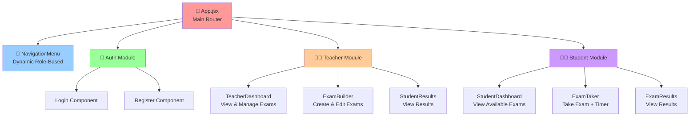
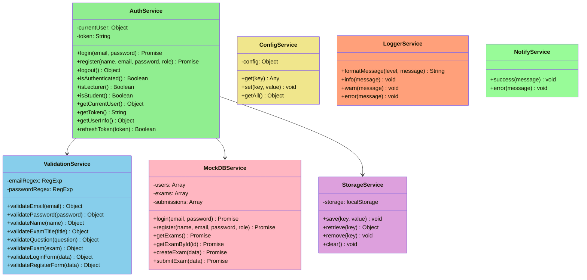
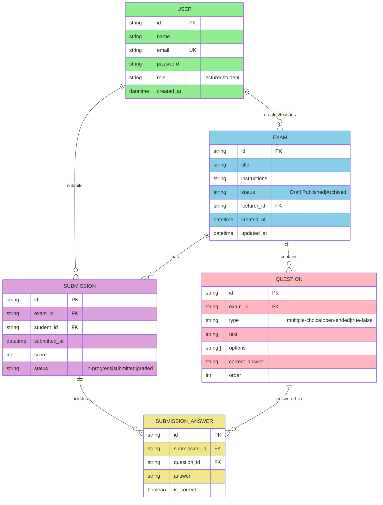
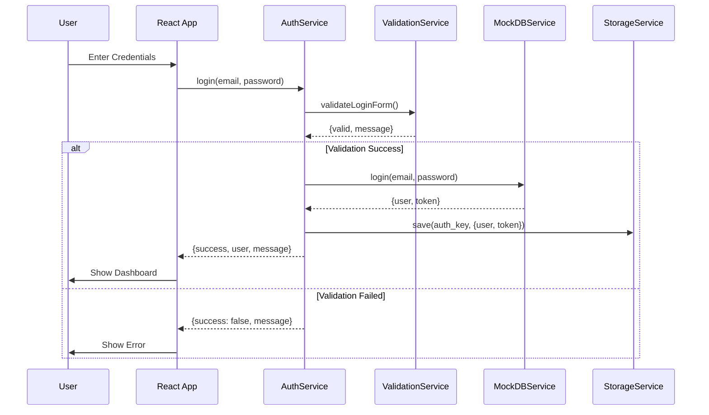
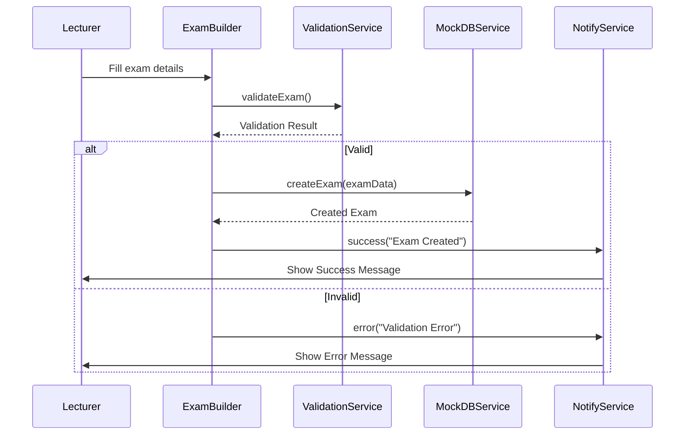
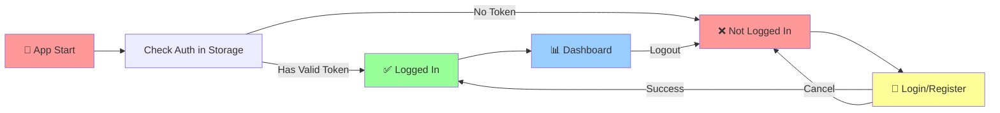
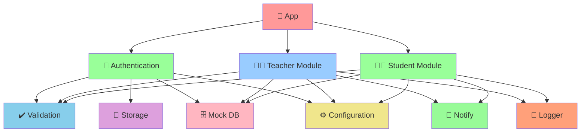

# ExamApp - דיאגרמות ארכיטקטורה

## 1️⃣ Components Hierarchy Diagram

---

## 2️⃣ UML Class Diagram - Services

---

## 3️⃣ Entity Relationship Diagram (DB/Views)

---

## 4️⃣ Use Case Diagram

```mermaid
graph TB
    subgraph Actors
        Lecturer["👨‍🏫 Lecturer"]
        Student["👨‍🎓 Student"]
        Guest["👤 Guest"]
    end
    
    subgraph System["📋 ExamApp System"]
        UC1["Login"]
        UC2["Register"]
        UC3["Create Exam"]
        UC4["Edit Exam"]
        UC5["Delete Exam"]
        UC6["Publish Exam"]
        UC7["Change Status"]
        UC8["View Exam List"]
        UC9["View Results"]
        UC10["Take Exam"]
        UC11["Submit Exam"]
        UC12["View My Results"]
    end
    
    Guest --> UC1
    Guest --> UC2
    
    Lecturer --> UC3
    Lecturer --> UC4
    Lecturer --> UC5
    Lecturer --> UC6
    Lecturer --> UC7
    Lecturer --> UC8
    Lecturer --> UC9
    
    Student --> UC8
    Student --> UC10
    Student --> UC11
    Student --> UC12
    
    style Lecturer fill:#99ccff
    style Student fill:#99ff99
    style Guest fill:#cccccc
    style UC1 fill:#ffcccc
    style UC2 fill:#ffcccc
    style UC3 fill:#99ccff
    style UC4 fill:#99ccff
    style UC5 fill:#99ccff
    style UC6 fill:#99ccff
    style UC7 fill:#99ccff
    style UC8 fill:#ffff99
    style UC9 fill:#99ccff
    style UC10 fill:#99ff99
    style UC11 fill:#99ff99
    style UC12 fill:#99ff99
```

---

## 5️⃣ Authentication Flow Sequence Diagram

---

## 6️⃣ Exam Creation Flow

---

## 7️⃣ Application State Flow

---

## 8️⃣ Module Dependencies

---

## Notes:

1. **Components Hierarchy** - מבנה הקומפוננטות המלא עם ניווט דינמי
2. **UML Class** - כל ה-Services עם שיטות ותכונות
3. **Entity Relationship** - מבנה ה-DB הלוגי עם יחסים
4. **Use Cases** - כל הפעולות שמשתמש יכול לעשות
5. **Sequence Diagrams** - זרימת התחברות ויצירת בחינה
6. **State Flow** - זרימת מצבי ההתחברות
7. **Dependencies** - קשרי תלות בין מודולים
