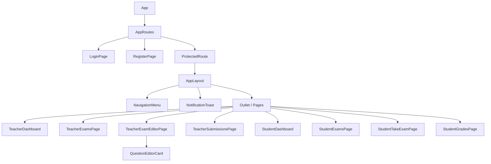
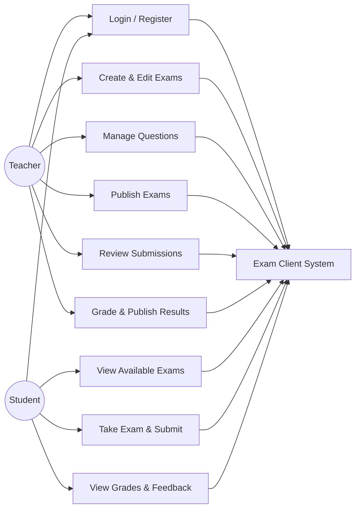
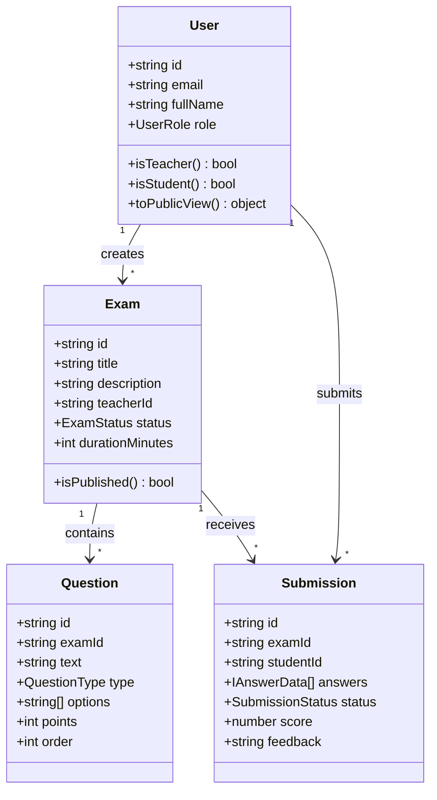
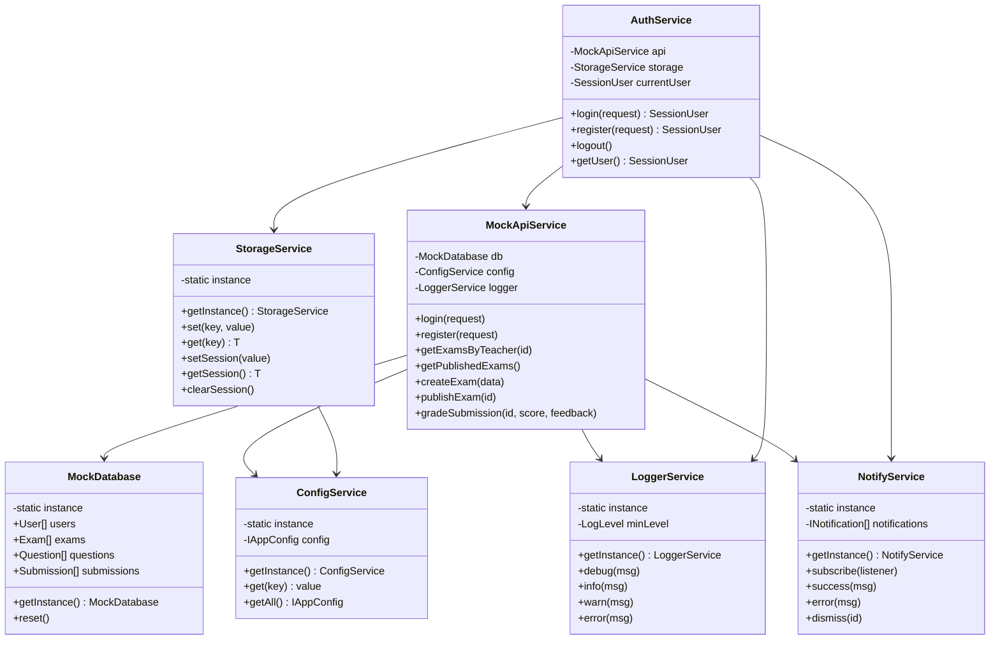
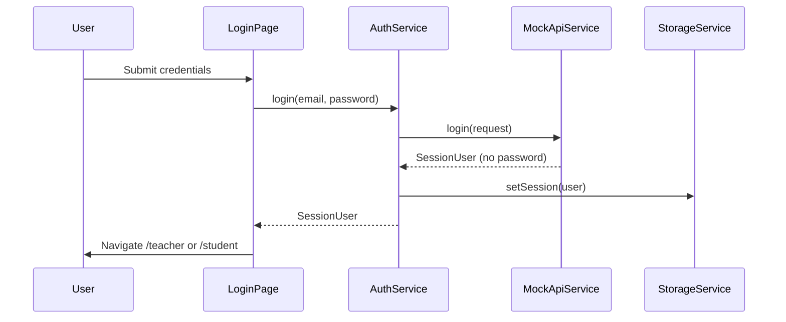
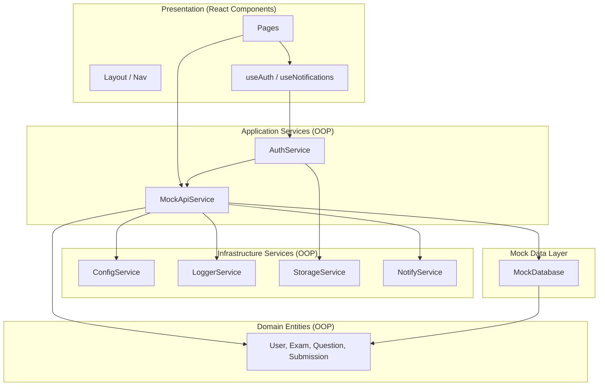

# Exam Management System — Client Diagrams

## 1. Components Hierarchy

## 2. Use Case Diagram

## 3. Main Entities (Domain / DB Mock Views)

## 4. Services UML (OOP — Non-Component Layer)

## 5. Application Flow (Auth + Role Routing)

## 6. Layer Architecture

